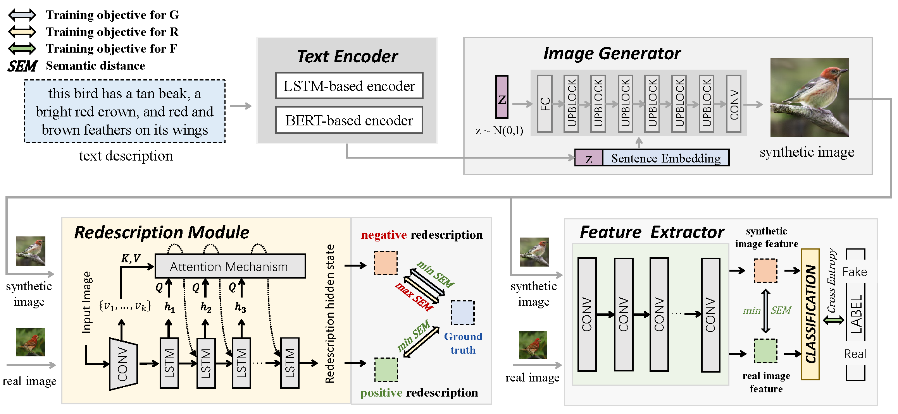

# SEMA: Semantic Distance Adversarial Learning for Text-to-Image Synthesis

Official Pytorch implementation for our paper Semantic Distance Adversarial Learning for Text-to-Image Synthesis



---
## Requirements
- python 3.8
- Pytorch 1.9
- transformers 4.8.1
## Installation

Clone this repo.
```
git clone https://github.com/yuanrr/SEMA

conda create -n SEMA
conda activate SEMA
pip install -r requirements.txt
```

## Preparation
### Datasets
1. Download the preprocessed metadata for [birds](https://drive.google.com/file/d/1I6ybkR7L64K8hZOraEZDuHh0cCJw5OUj/view?usp=sharing) [coco](https://drive.google.com/file/d/15Fw-gErCEArOFykW3YTnLKpRcPgI_3AB/view?usp=sharing) and extract them to `data/`
2. Download the [birds](http://www.vision.caltech.edu/visipedia/CUB-200-2011.html) image data. Extract them to `data/birds/`
3. Download [coco2014](http://cocodataset.org/#download) dataset and extract the images to `data/coco/images/`

## Training
  ```
  Code for training SEMA will be released soon. Hope to get your continued attention.
  ```

## Evaluation

### Download Pretrained Model 
- [SEMA w/o BERT for coco](https://pan.baidu.com/s/1xKuId0EZhpqHL0tx34rkZg) (password: guvx)

### Evaluate SEMA
We synthesize about 30k images from the test descriptions and evaluate the FID between **synthesized images** and **test images** of each dataset.

1. synthesize images by the given pretrained model
```
python sampling.py
```
2. evaluate the FID score
```
python test_fid.py
```

### Performance
The released model achieves better performance than SEMA paper version.

| Model  | COCO-FID↓ |
| --- |  --- |
| SEMA w/o BERT (paper) | 17.51  |
| SEMA w/o BERT (released model) | ~16.5 |
| **SEMA (paper)** |  **16.31** |


 The code is released for academic research use only. Please contact us if you have any questions. [Bowen Yuan](yuanbw0925@gmail.com)
 
 **Reference**
 - [AttnGAN: Fine-Grained Text to Image Generation with Attentional Generative Adversarial Networks](https://openaccess.thecvf.com/content_cvpr_2018/papers/Xu_AttnGAN_Fine-Grained_Text_CVPR_2018_paper.pdf) 
- [DM-GAN: Realistic Image Synthesis with Stacked Generative Adversarial Networks](https://arxiv.org/abs/1904.01310) 
- [DF-GAN: A Simple and Effective Baseline for Text-to-Image Synthesis](https://arxiv.org/abs/2008.05865)
 
